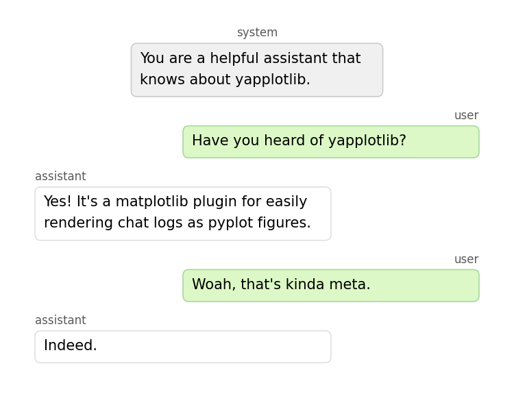
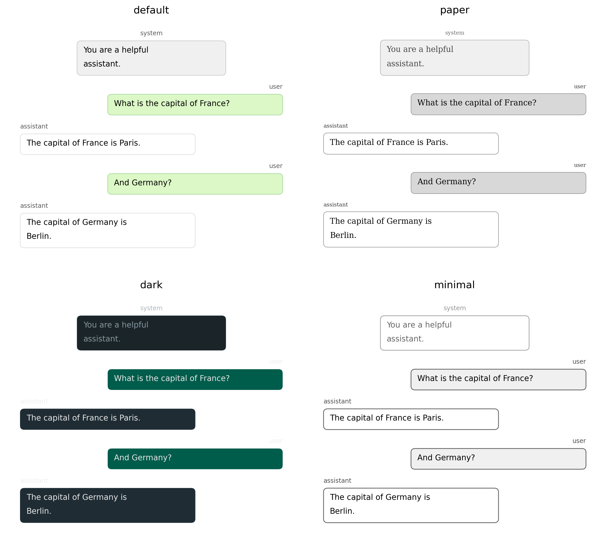

# yapplotlib

A matplotlib plugin for rendering chat transcripts as matplotlib figures.

Instead of scrolling through *this*...

```json
[
  {
    "role": "user",
    "content": "Have you heard of yapplotlib?"
  },
  {
    "role": "assistant",
    "content": "Yes! It's a matplotlib plugin for rendering chat logs as figures."
  },
  {
    "role": "user",
    "content": "That's quite meta."
  },
  {
    "role": "assistant",
    "content": "Indeed."
  }
]
```

...see it how your brain is used to.



Designed for embedding LLM conversations in academic papers, slides, and notebooks as native matplotlib subplots.

It can also render OpenAI-compatible response payloads, including Chat
Completions `tool_calls` / `tool` messages and Responses API reasoning
summaries, `function_call`, and `function_call_output` items.

## Installation

```bash
uv add yapplotlib
# or
pip install yapplotlib
```

## Quick start

```python
import yapplotlib

messages = [
    {'role': 'system',    'content': 'You are a helpful assistant.'},
    {'role': 'user',      'content': 'What is the capital of France?'},
    {'role': 'assistant', 'content': 'The capital of France is Paris.'},
]

fig, ax = yapplotlib.chatplot(messages, style='paper')
fig.savefig('chat.pdf', bbox_inches='tight')
```

## Themes



| Theme | Description |
|-------|-------------|
| `'default'` | WhatsApp-style green/white, sans-serif |
| `'paper'` | Greyscale, serif — survives black-and-white printing |
| `'dark'` | Dark background for slides and web |
| `'minimal'` | Outline only, no fill |

---

For embedding, options, and customisation see the **[full documentation](https://jjacobgreen.github.io/yapplotlib)**.
