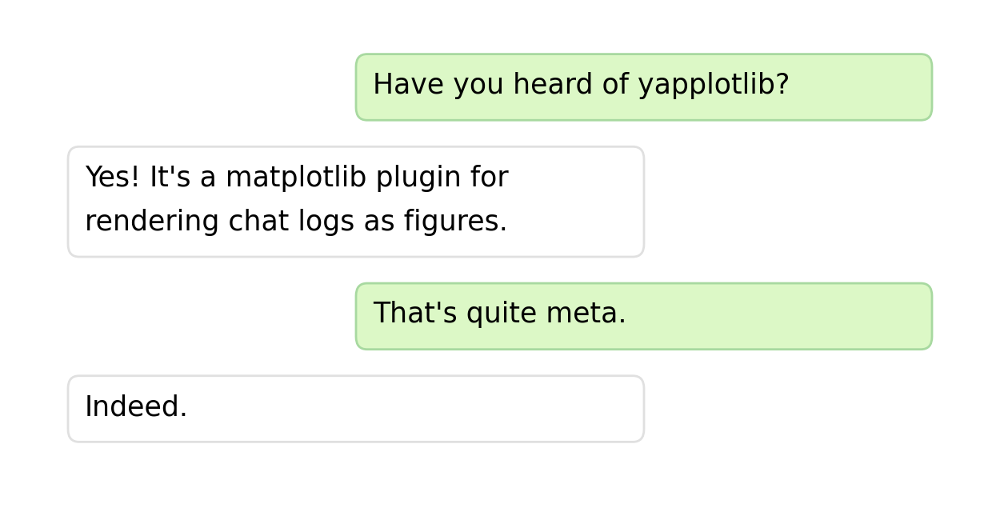

# yapplotlib

A matplotlib plugin for rendering chat transcripts as matplotlib figures.

Instead of scrolling through *this*...

```json
[
  {
    "role": "user",
    "content": "Have you heard of yapplotlib?"
  },
  {
    "role": "assistant",
    "content": "Yes! It's a matplotlib plugin for rendering chat logs as figures."
  },
  {
    "role": "user",
    "content": "That's quite meta."
  },
  {
    "role": "assistant",
    "content": "Indeed."
  }
]
```

...see it how your brain is used to.



Designed for embedding LLM conversations quickly and easily in academic papers, slides and notebooks as native matplotlib subplots.

## Installation

```bash
uv add yapplotlib
# or
pip install yapplotlib
```

## Quick start

```python
import yapplotlib

messages = [
    {'role': 'system',    'content': 'You are a helpful assistant.'},
    {'role': 'user',      'content': 'What is the capital of France?'},
    {'role': 'assistant', 'content': 'The capital of France is Paris.'},
]

fig, ax = yapplotlib.chatplot(messages, style='paper')
fig.savefig('chat.pdf', bbox_inches='tight')
```

## Embedding in a figure

The primary use case — a chat transcript as one panel of a multi-axis figure:

```python
import matplotlib.pyplot as plt
import yapplotlib

fig, axes = plt.subplots(1, 2, figsize=(11, 6))
axes[0].chatplot(messages, style='paper')
axes[1].plot(x, y)
plt.tight_layout()
```


## Themes


| Theme | Description |
|-------|-------------|
| `'default'` | WhatsApp-style green/white, sans-serif |
| `'paper'` | Greyscale, serif — survives black-and-white printing |
| `'dark'` | Dark background for slides and web |
| `'minimal'` | Outline only, no fill |

```python
fig, ax = yapplotlib.chatplot(messages, style='paper')
```

Custom styles merge with a named base:

```python
my_style = {**yapplotlib.themes['paper'], 'font_size': 11, 'user_facecolor': '#D0E8FF'}
fig, ax = yapplotlib.chatplot(messages, style=my_style)
```

## Message format

Each message is a plain dict:

```python
{
    'role':      'user',                             # required
    'content':   'Hello!',                           # required
    'name':      'Alice',                            # optional — display name override
    'timestamp': '10:04 AM',                         # optional — shown when show_timestamps=True
    'style':     {'user_facecolor': '#FFD700'},      # optional — per-message style override
}
```

Supported roles: `'user'`, `'assistant'`, `'system'`. Role aliases `'human'`, `'ai'`, `'bot'`, `'model'` are also accepted.

## Options

| Parameter | Default | Description |
|-----------|---------|-------------|
| `style` | `'default'` | Theme name or style dict |
| `bubble_width` | `0.6` | Max bubble width as fraction of axes width |
| `show_names` | `True` | Show sender name labels |
| `show_timestamps` | `False` | Show timestamp strings |
| `show_avatars` | `False` | Show circular avatar badges with initials |
| `sender_align` | `None` | Dict mapping role → `'left'` / `'right'` / `'center'` |
| `font_size` | theme | Font size in points |
| `line_spacing` | `1.4` | Line spacing multiplier |
| `bubble_spacing` | `0.6` | Gap between bubbles (in line-heights) |
| `pad` | `0.05` | Left/right edge padding (fraction of axes width) |

Global defaults can be set via `matplotlib.rcParams`:

```python
import matplotlib
matplotlib.rcParams['yapplotlib.style']        = 'paper'
matplotlib.rcParams['yapplotlib.bubble_width'] = 0.65
```

Available rcParam keys: `yapplotlib.style`, `yapplotlib.bubble_width`, `yapplotlib.show_names`, `yapplotlib.show_timestamps`, `yapplotlib.show_avatars`, `yapplotlib.font_size`, `yapplotlib.bubble_spacing`, `yapplotlib.line_spacing`, `yapplotlib.pad`.

## ChatPlot object

`chatplot()` returns a `ChatPlot` object:

```python
thread = ax.chatplot(messages)
thread.get_children()  # list of all managed matplotlib artists
thread.redraw()        # re-layout (e.g. after resizing)
thread.disconnect()    # remove canvas event callbacks
```

## mplstyle integration

```python
import matplotlib.pyplot as plt
with plt.style.context('yapplotlib.paper'):
    fig, ax = yapplotlib.chatplot(messages)
```

Available styles: `yapplotlib.paper`, `yapplotlib.dark`.

## Development

```bash
uv run pytest
uv run python smoke_test.py   # renders all styles to smoke_output/
```

---

**Planned:** thinking/reasoning message bubbles, tool-call display, full markdown rendering, avatar icons, Plotly support.
