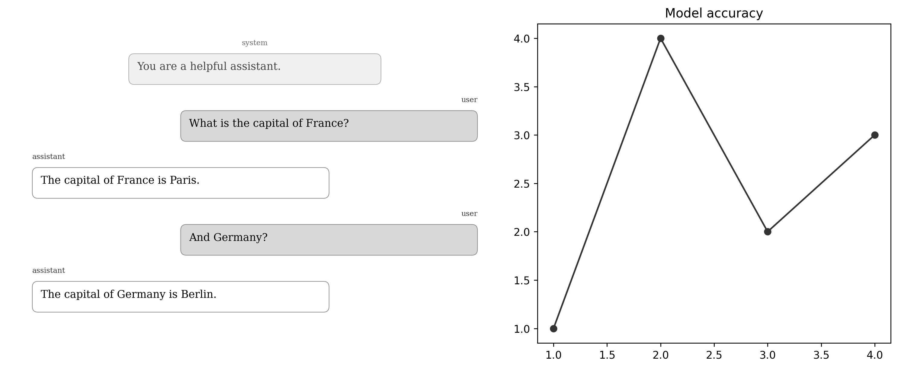

# Usage

## Embedding in a figure

The primary use case — a chat transcript as one panel of a multi-axis figure:

```python
import matplotlib.pyplot as plt
import yapplotlib

fig, axes = plt.subplots(1, 2, figsize=(12, 5),
                         gridspec_kw={'width_ratios': [1.4, 1]})
axes[0].chatplot(messages, style='paper')
axes[1].plot(x, y)
plt.tight_layout()
```



## Message format

Each message is a plain dict:

```python
{
    'role':      'user',                         # required
    'content':   'Hello!',                       # required
    'name':      'Alice',                        # optional — display name override
    'timestamp': '10:04 AM',                     # optional — shown when show_timestamps=True
    'style':     {'user_facecolor': '#FFD700'},  # optional — per-message style override
}
```

Supported roles: `'user'`, `'assistant'`, `'system'`. Aliases `'human'`, `'ai'`, `'bot'`, and `'model'` are also accepted.

## Options

| Parameter | Default | Description |
|-----------|---------|-------------|
| `style` | `'default'` | Theme name or style dict |
| `bubble_width` | `0.6` | Max bubble width as fraction of axes width |
| `show_names` | `True` | Show sender name labels |
| `show_timestamps` | `False` | Show timestamp strings |
| `show_avatars` | `False` | Show circular avatar badges with initials |
| `sender_align` | `None` | Dict mapping role → `'left'` / `'right'` / `'center'` |
| `font_size` | theme | Font size in points |
| `line_spacing` | `1.4` | Line spacing multiplier |
| `bubble_spacing` | `0.6` | Gap between bubbles (in line-heights) |
| `pad` | `0.05` | Left/right edge padding (fraction of axes width) |

## Style customisation

Partial style dicts merge with a named base theme:

```python
my_style = {**yapplotlib.themes['paper'], 'font_size': 11, 'user_facecolor': '#D0E8FF'}
fig, ax = yapplotlib.chatplot(messages, style=my_style)
```

Per-message overrides:

```python
messages[2]['style'] = {'user_facecolor': '#FFD700'}
```

## ChatPlot object

`chatplot()` returns a `ChatPlot` object:

```python
thread = ax.chatplot(messages)
thread.get_children()  # list of all managed matplotlib artists
thread.redraw()        # re-layout (e.g. after resizing)
thread.disconnect()    # remove canvas event callbacks
```

## rcParams

Global defaults can be overridden via `matplotlib.rcParams`:

```python
import matplotlib
matplotlib.rcParams['yapplotlib.style']        = 'paper'
matplotlib.rcParams['yapplotlib.bubble_width'] = 0.65
matplotlib.rcParams['yapplotlib.show_names']   = False
```

Available keys: `yapplotlib.style`, `yapplotlib.bubble_width`, `yapplotlib.show_names`,
`yapplotlib.show_timestamps`, `yapplotlib.show_avatars`, `yapplotlib.font_size`,
`yapplotlib.bubble_spacing`, `yapplotlib.line_spacing`, `yapplotlib.pad`.

## mplstyle integration

```python
import matplotlib.pyplot as plt

with plt.style.context('yapplotlib.paper'):
    fig, ax = yapplotlib.chatplot(messages)
```

Available styles: `yapplotlib.paper`, `yapplotlib.dark`.
